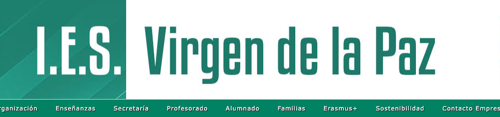

# Curso de Desarrollo de Aplicaciones Web a Distancia por IES Virgen de la Paz 2025

💻 Repositorio del curso de Desarrollo de Aplicaciones Web a distancia.👨🏻‍🎓

Este es nuestro repositorio del segundo año en DAW a distancia. Dejo aquí todo lo relacionado con el módulo. Espero que lo disfrutéis. Gracias.

🚀 Happy Code!
> ##### Si consideras útil este curso, apóyalo haciendo "★ Star" en el repositorio. ¡Gracias!

## Index
- [Digitalización aplicada a los sectores productivos (GS)](DIGITALIZACION)
- [Sostenibilidad aplicada al sistema productivo](SOSTENIBILIDAD)
- [Módulo profesional optativo I (Python)](MODULO_OPTATIVO_PYTHON)
- [Módulo profesional optativo II (Cloud)](MODULO_OPTATIVO_CLOUD)
- [Proyecto intermodular de desarrollo de aplicaciones web](PROYECTO)

🤩 Enjoy it!
## Enlaces de interés
* Web IES Virgen de la Paz: [IESVP](https://www.educa2.madrid.org/web/centro.ies.lapaz.alcobendas)
* Web oficial (Documentación, descarga...): [w3schools](https://www.w3schools.com/)
* Web Oficial de Mozilla: [Mozilla](https://developer.mozilla.org/es/)
* Web: [Sitio Libre](https://www.sitiolibre.com/)

### En mi perfil de GitHub tienes más información

#### Puedes apoyar mi trabajo haciendo "☆ Star" en el repo o nominarme a "GitHub Star". ¡Gracias!

